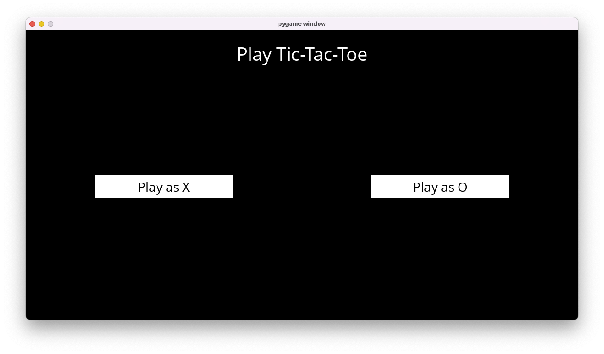

# Tictactoe

This Tictactoe AI is a game developed with the Pygame library and utilizes the Minamix search algorithm to play optimally.



## Getting Started
1. Clone this repository

   ```sh
    git clone git@github.com:richardl2003/tictactoe.git
   ```
2. Navigate to the root directory of the cloned project, run `pip3 install -r requirements.txt` to install Pygame locally on your machine

3. Have fun :)